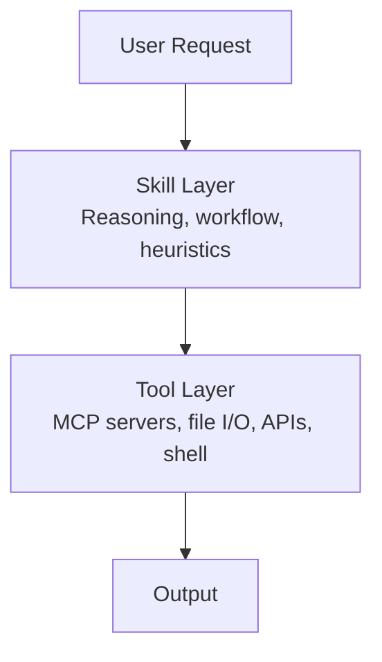
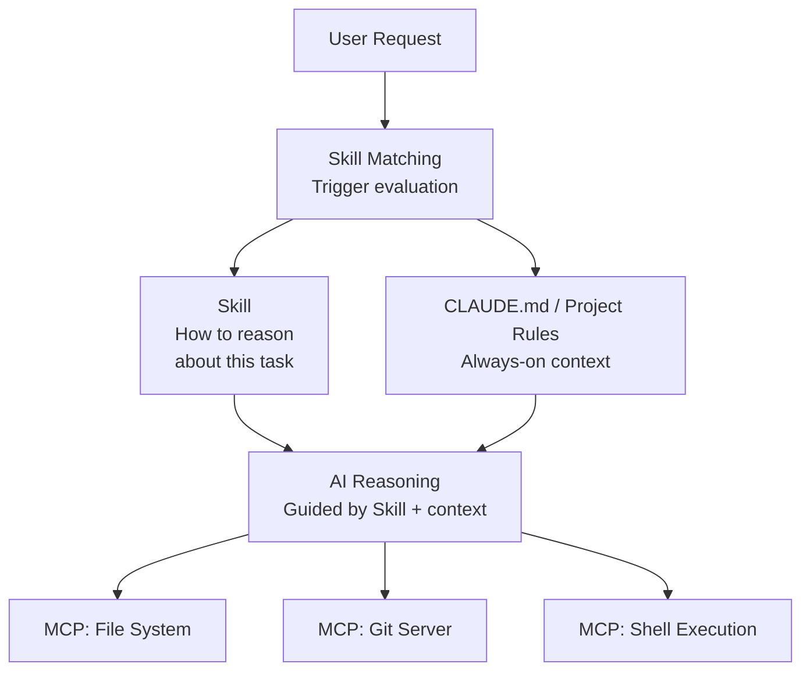
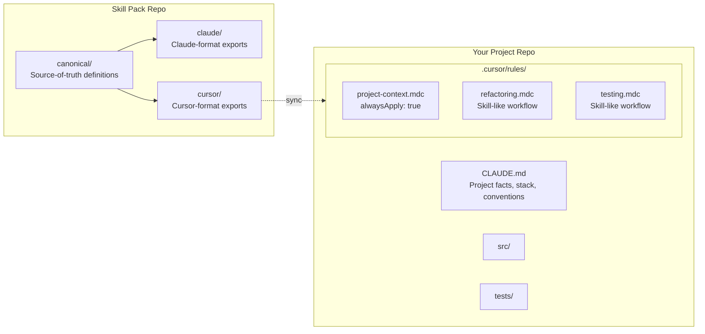
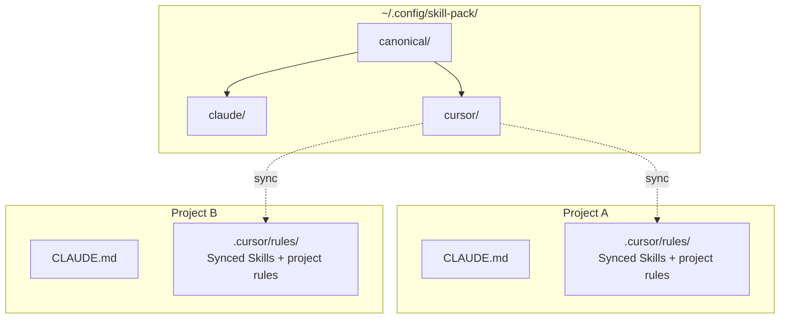

# Building Skills Into Your Dev Environment

A comprehensive technical guide for building, structuring, and implementing AI Skills in Claude Code and Cursor. Written for engineers building scalable, repo-ready Skill systems for long-term use.

> Accuracy note: tooling changes quickly. This guide reflects practical behavior observed in modern Claude/Cursor workflows (including Cursor Rules and Agent Skills), but you should still verify against current product docs for your exact version.

---

## Part 1: What Skills Are

Skills are **domain-specific reasoning modules** that shape how an AI assistant approaches a category of work. They are not tools, plugins, APIs, or model fine-tunes. They are structured behavioral instructions that the AI loads and follows when a request matches their domain.

A Skill defines:

- **When** to activate (triggers or scoping rules)
- **How** to think about the problem (instructions, workflows, heuristics)
- **What** good output looks like (examples, constraints, output formats)

Skills sit in the **reasoning layer** of the AI stack. They do not perform actions themselves. They direct how the AI uses its tools, structures its output, and sequences its work. A Skill tells the AI _how to think_. An MCP tool tells the AI _what it can do_.

### The Skill Stack



---

## Part 2: Claude Code Skills

### How Claude Code Skills Actually Work

Claude Code has a built-in Skill system. Skills are defined in the system prompt that Claude Code constructs before each conversation. When a Skill's trigger conditions match the user's request, Claude Code activates it by injecting the Skill's instructions into the active context.

In practice, Claude-style workflows usually operate through two mechanisms:

1. **User-invocable workflows/commands** -- explicit invocation (often slash-command driven, depending on platform/version)
2. **Auto-triggered guidance** -- activated when request/context matches defined patterns

Exact command names and activation surfaces vary by release, but the key distinction is explicit invocation vs automatic matching.

### Where Skills Live

Claude Code loads Skills from these locations:

| Location | Scope | Purpose |
|---|---|---|
| Built-in (system prompt) | Global | Core Skills shipped with Claude Code |
| `CLAUDE.md` | Project | Project-level instructions (not Skills per se, but persistent context) |
| `~/.claude/` config | User | User-level defaults and memory |
| Skill definitions in system config | Global | Registered Skill modules |

**Important distinction:** `CLAUDE.md` files are _not_ Skills. They are persistent context documents. Skills have triggers, structured instructions, and activation logic. `CLAUDE.md` is always-on project context. Both are useful, but they serve different purposes.

### Anatomy of a Claude Code Skill

A Claude Code Skill has these components:

```yaml
name: "skill-name"
description: "One-line summary of what this Skill does"
triggers:
  - "natural language pattern that activates this Skill"
  - "another trigger phrase"
  - "TRIGGER when: condition description"
  - "DO NOT TRIGGER when: exclusion condition"
instructions: |
  Step-by-step instructions the model follows when this Skill is active.

  These can include:
  - Sequenced workflows
  - Decision trees
  - Output format requirements
  - Constraints and guardrails
  - References to tools the Skill should use
examples:
  - input: "Example user request"
    output: "Expected model behavior or output"
```

### Trigger Design

Triggers are the most critical part of a Skill. They determine when the Skill activates and when it stays dormant. Good triggers are:

- **Specific** -- match the exact domain, not vague keywords
- **Exclusive** -- include `DO NOT TRIGGER` conditions to prevent false activation
- **Observable** -- can be matched against the user's actual request or the codebase state

**Trigger patterns:**

```yaml
# Pattern-based: match user language
triggers:
  - "review this pull request"
  - "PR review"
  - "check this diff"

# Context-based: match what's happening in the project
triggers:
  - "TRIGGER when: code imports anthropic or @anthropic-ai/sdk"
  - "DO NOT TRIGGER when: code imports openai or other AI SDK"

# Explicit invocation
triggers:
  - "/architecture-review"
```

### Complete Skill Examples

#### Architecture Review Skill

```yaml
name: "architecture-review"
description: "Structured review of system architecture decisions"
triggers:
  - "review the architecture"
  - "architecture review"
  - "evaluate this design"
  - "/arch-review"
  - "DO NOT TRIGGER when: user is asking about UI layout or CSS"
instructions: |
  When performing an architecture review:

  1. READ the project structure. Identify entry points, layers, and boundaries.
  2. MAP dependencies. Check for circular imports, tight coupling, layer violations.
  3. EVALUATE against principles:
     - Single Responsibility: Does each module do one thing?
     - Dependency Inversion: Do high-level modules depend on abstractions?
     - Interface Segregation: Are interfaces focused or bloated?
     - 12-Factor compliance: Config from env? Stateless? Logs to stdout?
  4. IDENTIFY risks:
     - Scalability bottlenecks
     - Single points of failure
     - Missing error boundaries
     - Insufficient observability
  5. OUTPUT a structured report:
     - Summary (2-3 sentences)
     - Architecture diagram (text-based)
     - Findings (categorized: Critical / Warning / Info)
     - Recommendations (prioritized)

  Use the codebase exploration tools to read actual files. Do not speculate
  about code you haven't read.
```

#### Refactoring Workflow Skill

```yaml
name: "refactoring-workflow"
description: "Systematic code refactoring with safety checks"
triggers:
  - "refactor this"
  - "clean up this code"
  - "improve this module"
  - "/refactor"
  - "DO NOT TRIGGER when: user wants a complete rewrite from scratch"
instructions: |
  When refactoring code:

  1. READ the target code and all its callers/dependents.
  2. IDENTIFY what to change:
     - Code smells (duplication, long methods, deep nesting, feature envy)
     - Structural issues (wrong abstraction level, misplaced logic)
     - Naming problems
  3. PLAN the refactoring:
     - List each change as a discrete, reversible step
     - Order steps so tests pass after each one
     - Flag any changes that alter public API surface
  4. EXECUTE incrementally:
     - One logical change per edit
     - Preserve existing behavior unless explicitly asked to change it
     - Do not add features, comments, or "improvements" beyond scope
  5. VERIFY:
     - Run existing tests if available
     - Confirm no callers are broken
     - Confirm public API is unchanged (unless intentionally modified)

  Never refactor and change behavior in the same step.
```

#### Documentation Pipeline Skill

```yaml
name: "documentation-pipeline"
description: "Generate structured documentation from code analysis"
triggers:
  - "document this"
  - "write docs for"
  - "generate documentation"
  - "/docs"
  - "DO NOT TRIGGER when: user is writing prose or narrative content"
instructions: |
  When generating documentation:

  1. READ the target code thoroughly. Understand the full module.
  2. CLASSIFY the documentation type:
     - API reference: endpoints, parameters, responses, errors
     - Module overview: purpose, dependencies, usage patterns
     - Architecture doc: system boundaries, data flow, deployment
     - README: quick start, prerequisites, configuration
  3. EXTRACT information from code:
     - Public interfaces and their contracts
     - Configuration options and defaults
     - Error handling patterns
     - Dependencies and version requirements
  4. WRITE documentation that:
     - Leads with purpose ("what this does and why")
     - Shows working examples (not pseudocode)
     - Documents edge cases and failure modes
     - Avoids restating obvious type signatures
  5. FORMAT for the target system:
     - Markdown for repo docs
     - JSDoc/XMLDoc for inline API docs
     - OpenAPI spec for REST endpoints

  Do not generate documentation for code you haven't read.
  Do not add boilerplate sections with no real content.
```

### Claude Code Skill Best Practices

**Keep Skills focused.** One Skill per domain. Don't build a "super Skill" that handles architecture, refactoring, and documentation. Build three separate Skills.

**Make triggers mutually exclusive.** If two Skills could activate for the same request, refine their triggers until exactly one matches. Use `DO NOT TRIGGER` conditions aggressively.

**Write instructions as procedures, not descriptions.** Bad: "The model should review code carefully." Good: "1. Read the target file. 2. List all public methods. 3. For each method, check..."

**Reference tools explicitly.** If a Skill should use specific tools (file reading, grep, shell commands), name them in the instructions. Don't assume the model will figure it out.

**Test with edge cases.** After writing a Skill, mentally simulate what happens if the user's request is ambiguous, incomplete, or slightly off-domain. Adjust triggers and instructions accordingly.

### How CLAUDE.md and Skills Interact

`CLAUDE.md` is **always-on context**. Skills are **conditionally activated reasoning modules**. They complement each other:

| Concern | Use CLAUDE.md | Use a Skill |
|---|---|---|
| Project stack and conventions | Yes | No |
| "Always use X library" | Yes | No |
| "When refactoring, follow these steps" | No | Yes |
| Build commands and test commands | Yes | No |
| Structured review workflow | No | Yes |
| File naming conventions | Yes | No |
| Multi-step documentation pipeline | No | Yes |

`CLAUDE.md` provides the project-specific _facts_. Skills provide the domain-specific _procedures_.

---

## Part 3: Cursor Rules and Agent Skills

### What Cursor Actually Supports

Cursor supports two guidance systems that together cover most "Skill-like" needs:

1. **Project Rules** (`.cursor/rules/*.mdc`) -- scoped instruction blocks with `globs`/`alwaysApply`
2. **`.cursorrules`** (legacy) -- a single project-level instruction file
3. **Agent Skills** (`SKILL.md` packs) -- reusable procedural playbooks that an agent can load when relevant
4. **Workspace-level instructions** -- global preferences/instructions
5. **MCP integration** -- tool servers for actions

Important nuance: Cursor does not expose a single deterministic, user-defined trigger registry equivalent to Claude-style trigger YAML. Activation is a mix of file scope (`globs`), always-on rules, and agent/tooling behavior.

### Cursor Rules vs Agent Skills

| Mechanism | Best for | Activation style |
|---|---|---|
| `.cursor/rules/*.mdc` | Repo conventions, file-scoped guidance | `alwaysApply`, `globs`, relevance |
| `SKILL.md` packs | Reusable multi-step workflows (playbooks) | Loaded by agent when task matches |
| `.cursorrules` | Legacy always-on project context | Always-on |

### Cursor's Rule System: The Foundation

Cursor project rules use `.mdc` files with YAML frontmatter:

```markdown
---
description: Short description of what this rule covers
globs: "**/*.cs,**/Controllers/**/*.cs"
alwaysApply: false
---

# Rule Title

- Instruction 1
- Instruction 2
- Instruction 3
```

**Frontmatter fields:**

| Field | Type | Purpose |
|---|---|---|
| `description` | string | Tells Cursor when this rule is relevant (acts as a soft trigger) |
| `globs` | string | File patterns that activate this rule (e.g., `"**/*.ts"`) |
| `alwaysApply` | boolean | If `true`, this rule is always injected into context. If `false`, only when globs match or description is relevant. |

### How Cursor Decides Which Rules to Load

Cursor's rule activation is simpler than Claude's Skill triggers:

1. **`alwaysApply: true`** -- always loaded, regardless of context
2. **`globs` match** -- loaded when the user is working on files matching the glob pattern
3. **`description` match** -- Cursor may use the description to decide relevance (soft matching, not deterministic)

This means your "trigger" in Cursor is primarily file scope (`globs`) plus `alwaysApply`, with optional agent-driven skill loading for broader workflows.

### Building Skill-Like Rules for Cursor

To simulate a Skill in Cursor, create a `.mdc` file that encodes a complete workflow:

#### Architecture Review (Cursor-style)

File: `.cursor/rules/architecture-review.mdc`

```markdown
---
description: Architecture review workflow for evaluating system design
alwaysApply: false
---

# Architecture Review

When asked to review architecture:

1. **Map the structure**: Read the project layout, identify layers, entry points, and service boundaries.
2. **Check dependency direction**: Verify no layer imports upward. Flag circular dependencies.
3. **Evaluate principles**:
   - Single Responsibility per module
   - Dependency Inversion (depend on abstractions)
   - Config from environment, not hardcoded
4. **Identify risks**: Scalability bottlenecks, single points of failure, missing error boundaries.
5. **Output format**:
   - Summary (2-3 sentences)
   - Findings table (Critical / Warning / Info)
   - Prioritized recommendations
```

#### Refactoring Workflow (Cursor-style)

File: `.cursor/rules/refactoring.mdc`

```markdown
---
description: Refactoring workflow - systematic code improvement
globs: "**/*.ts,**/*.js,**/*.cs,**/*.py"
alwaysApply: false
---

# Refactoring Workflow

When asked to refactor:

1. Read the target code AND all its callers before changing anything.
2. Identify specific smells: duplication, long methods, deep nesting, wrong abstraction level.
3. Plan changes as discrete, reversible steps. List them before starting.
4. Execute one logical change per edit. Keep tests passing between steps.
5. Do not add features, extra comments, or unrelated improvements.
6. Do not change behavior unless explicitly asked. Refactoring preserves behavior.
7. After completion, list what changed and confirm no public API surface was altered.
```

#### Documentation Pipeline (Cursor-style)

File: `.cursor/rules/documentation.mdc`

```markdown
---
description: Documentation generation from code analysis
globs: "**/*.ts,**/*.js,**/*.cs,**/*.py"
alwaysApply: false
---

# Documentation Pipeline

When asked to generate documentation:

1. Read the full module before writing anything. Do not document code you haven't read.
2. Determine doc type: API reference, module overview, architecture doc, or README.
3. Lead with purpose: what the module does and why it exists.
4. Include working examples pulled from actual usage in the codebase.
5. Document edge cases and failure modes, not just the happy path.
6. Skip boilerplate sections that would contain no real content.
7. Match the format to the target: Markdown for repo docs, JSDoc/XMLDoc for inline, OpenAPI for REST.
```

### Organizing Cursor Rules as a Skill System

Structure your `.cursor/rules/` directory by domain:

```
.cursor/
  rules/
    # Always-on project context (like CLAUDE.md)
    project-context.mdc          # alwaysApply: true
    stack-conventions.mdc        # alwaysApply: true

    # Domain-specific Skills (activated by glob or description)
    architecture-review.mdc      # alwaysApply: false
    refactoring.mdc              # alwaysApply: false, globs: source files
    documentation.mdc            # alwaysApply: false, globs: source files
    testing.mdc                  # alwaysApply: false, globs: test files
    api-design.mdc               # alwaysApply: false, globs: controller files
    error-handling.mdc           # alwaysApply: false, globs: source files
    security.mdc                 # alwaysApply: false, globs: auth/security files
```

**Key rules for maintainability:**

- Keep each `.mdc` file under 50 lines. Cursor injects these into context, and bloated rules waste tokens.
- Use `alwaysApply: true` sparingly. Only for project identity and universal conventions.
- Use `globs` to scope rules to the files where they matter.
- Name files by the _domain_ they cover, not the _action_ they perform.

### Cursor Differences Compared to Claude Skills

| Capability | Claude Code | Cursor |
|---|---|---|
| Natural language triggers | Yes | No (description-based soft match) |
| File pattern scoping | No (not native) | Yes (`globs`) |
| Conditional activation | Trigger matching | `alwaysApply` + `globs` + relevance/agent loading |
| Always-on context | `CLAUDE.md` | `alwaysApply: true` rules |
| Explicit invocation | Slash commands and platform-specific flows | Indirect (rule scope / agent workflow selection) |
| Trigger exclusions | `DO NOT TRIGGER when:` | Not supported |
| Structured YAML format | Yes | Frontmatter + Markdown |

---

## Part 4: Skills and MCP Integration

### The Separation of Concerns

```
Skills    = HOW the AI reasons about a task
MCP Tools = WHAT the AI can do to execute the task
```

Skills and MCP tools occupy different layers. A well-designed Skill references MCP tools by name when the workflow requires specific actions, but it does not _implement_ those actions.

**Example: A deployment review Skill that uses MCP tools**

```yaml
name: "deployment-review"
description: "Pre-deployment validation checklist"
triggers:
  - "review before deploy"
  - "deployment checklist"
instructions: |
  Before approving a deployment:

  1. Use file reading tools to check for uncommitted changes.
  2. Use shell tools to run the test suite. All tests must pass.
  3. Use grep tools to search for TODO, FIXME, HACK in changed files.
  4. Use git tools to verify the branch is up to date with main.
  5. Check environment config files for any hardcoded secrets or localhost URLs.
  6. Produce a go/no-go report with findings.

  If any check fails, recommend blocking the deployment and list required fixes.
```

The Skill defines the _procedure_. The MCP tools (file system, shell, git) provide the _capabilities_. Neither works well alone. Together, they form a complete automated workflow.

### When to Use a Skill vs. an MCP Tool

| You need... | Use |
|---|---|
| A repeatable reasoning workflow | Skill |
| Access to external systems | MCP Tool |
| Domain-specific decision criteria | Skill |
| File I/O, API calls, DB queries | MCP Tool |
| Output formatting standards | Skill |
| Code execution | MCP Tool |
| Multi-step sequenced procedures | Skill |
| A new capability the AI doesn't have | MCP Tool |

### MCP + Skills Architecture



---

## Part 5: Cross-Platform Skill Packs

### The Problem

You want Skills that work in both Claude Code and Cursor. The two systems use different formats, different activation models, and different scoping. A naive approach (write everything twice) is unmaintainable.

### The Solution: Canonical Skill Format + Transpilation

Define your Skills in a **canonical format** (Markdown with structured frontmatter), then generate platform-specific outputs.

#### Canonical Skill Format

File: `skills/architecture-review.skill.md`

```markdown
---
name: architecture-review
description: Structured review of system architecture decisions
domain: architecture
triggers:
  - "review the architecture"
  - "architecture review"
  - "evaluate this design"
  - "/arch-review"
excludes:
  - "UI layout"
  - "CSS"
globs:
  - "**/*.cs"
  - "**/*.ts"
  - "**/*.py"
---

# Architecture Review

When performing an architecture review:

1. READ the project structure. Identify entry points, layers, and boundaries.
2. MAP dependencies. Check for circular imports, tight coupling, layer violations.
3. EVALUATE against SOLID principles and 12-Factor compliance.
4. IDENTIFY risks: scalability bottlenecks, SPOFs, missing error boundaries.
5. OUTPUT a structured report:
   - Summary (2-3 sentences)
   - Findings (Critical / Warning / Info)
   - Prioritized recommendations

Do not speculate about code you haven't read. Use codebase exploration tools.
```

#### Generating Claude Code Format

From the canonical format, produce a Claude Skill by using the `triggers` and `excludes` fields:

```yaml
name: "architecture-review"
description: "Structured review of system architecture decisions"
triggers:
  - "review the architecture"
  - "architecture review"
  - "evaluate this design"
  - "/arch-review"
  - "DO NOT TRIGGER when: user is asking about UI layout or CSS"
instructions: |
  # Architecture Review
  [... body from canonical file ...]
```

#### Generating Cursor Format

From the canonical format, produce a `.mdc` file using the `globs` and `description` fields:

File: `.cursor/rules/architecture-review.mdc`

```markdown
---
description: Structured review of system architecture decisions
globs: "**/*.cs,**/*.ts,**/*.py"
alwaysApply: false
---

# Architecture Review
[... body from canonical file ...]
```

### Shared Skill Pack Directory Structure

```
skill-pack/
  canonical/
    architecture-review.skill.md
    refactoring.skill.md
    documentation.skill.md
    testing.skill.md
    security-review.skill.md
    deployment-check.skill.md

  claude/                          # Generated or manually maintained
    architecture-review.yaml
    refactoring.yaml
    documentation.yaml
    ...

  cursor/                          # Generated or manually maintained
    architecture-review.mdc
    refactoring.mdc
    documentation.mdc
    ...

  scripts/
    generate-claude.sh             # Converts canonical -> Claude format
    generate-cursor.sh             # Converts canonical -> Cursor .mdc
    sync-to-project.sh             # Copies generated files to target repos

  README.md
```

### A Simple Sync Script

```bash
#!/bin/bash
# sync-to-project.sh -- deploy Skills to a target project

TARGET="$1"

if [ -z "$TARGET" ]; then
  echo "Usage: sync-to-project.sh /path/to/project"
  exit 1
fi

# Cursor rules
mkdir -p "$TARGET/.cursor/rules"
cp cursor/*.mdc "$TARGET/.cursor/rules/"

# Claude context (append Skill references to CLAUDE.md if needed)
echo "Skills synced to $TARGET"
```

---

## Part 6: Comparison Matrix

### Claude Code vs. Cursor -- Feature-by-Feature

| Feature | Claude Code | Cursor |
|---|---|---|
| **Skill system** | First-class, built-in | Rules + Agent Skills (different activation model) |
| **Activation model** | Trigger matching + `/invoke` | `alwaysApply` flag + glob patterns |
| **File format** | YAML/JSON Skill definitions | `.mdc` (Markdown + YAML frontmatter) |
| **Scoping** | Project (via workspace) | Repo (via `.cursor/rules/`) |
| **Always-on context** | `CLAUDE.md` (hierarchical) | `alwaysApply: true` rules |
| **Trigger exclusions** | `DO NOT TRIGGER when:` | Not supported |
| **Explicit invocation** | Slash-driven / platform-defined | Indirect workflow/agent selection |
| **MCP integration** | Full (tools referenced in Skills) | Full (tools available alongside rules) |
| **Portability** | Tied to Claude Code | Tied to Cursor IDE |
| **Version control** | `CLAUDE.md` in repo; Skills in config | `.cursor/rules/` in repo |

### When to Use Which

| Scenario | Best Platform | Why |
|---|---|---|
| Multi-step reasoning workflows | Claude Code | Real trigger system, structured activation |
| File-scoped coding conventions | Cursor | Glob-based activation matches file context |
| Cross-repo standards | Both (Skill Pack) | Canonical format deployed to both |
| Complex conditional workflows | Claude Code | Supports trigger exclusions and explicit invocation |
| Quick "always follow these rules" | Cursor | `alwaysApply: true` is simple and reliable |
| Tool-heavy automation | Either + MCP | Both support MCP equally well |

---

## Part 7: Recommended Architecture

### For a Solo Developer or Small Team



### For Multiple Projects



### Layer Responsibilities

| Layer | Contains | Examples |
|---|---|---|
| **Project Context** | Facts about this specific project | Stack, conventions, key paths, build commands |
| **Skills** | Reusable reasoning workflows | Architecture review, refactoring, docs pipeline |
| **MCP Tools** | Action capabilities | File I/O, git, shell, APIs, databases |
| **User Memory** | Persistent preferences | "Always use bun", "prefer functional style" |

---

## Part 8: Skill Design Checklist

Use this when creating a new Skill for either platform.

### Definition

- [ ] The Skill has a clear, single domain (not "do everything")
- [ ] The name is a noun phrase describing the domain, not a verb (e.g., `architecture-review`, not `review-code`)
- [ ] The description is one sentence that explains when this Skill applies

### Triggers (Claude) / Scoping (Cursor)

- [ ] Triggers match the specific domain, not generic keywords
- [ ] Exclusion conditions prevent false activation (`DO NOT TRIGGER when:`)
- [ ] For Cursor: appropriate globs are set, or `alwaysApply` is justified
- [ ] No overlap with existing Skills/rules in the project

### Instructions

- [ ] Written as a numbered procedure, not a description
- [ ] Each step is actionable ("READ the file", "LIST the methods", "CHECK for X")
- [ ] The Skill references specific tools it should use (when applicable)
- [ ] Output format is defined (what the result should look like)
- [ ] Constraints are explicit ("do NOT add features beyond scope")
- [ ] The Skill handles edge cases (incomplete input, ambiguous requests)

### Maintainability

- [ ] Kept under 50 lines of instructions (for context efficiency)
- [ ] No duplication with other Skills or project context files
- [ ] Stored in version control
- [ ] If shared across projects, uses the canonical Skill Pack format
- [ ] Tested mentally against 3+ realistic user requests to verify trigger behavior

### Integration

- [ ] Does not conflict with `CLAUDE.md` or `alwaysApply` rules
- [ ] MCP tool dependencies are documented (if the Skill assumes specific tools)
- [ ] Works standalone (not dependent on another Skill being active simultaneously)

---

## Part 9: Example Skill Pack -- Software Development

A complete starter pack of Skills for a software development workflow. Each is shown in canonical format.

### Code Review Skill

```markdown
---
name: code-review
description: Structured code review with categorized findings
domain: review
triggers:
  - "review this code"
  - "code review"
  - "/review"
excludes:
  - "architecture review"
  - "security audit"
globs:
  - "**/*.ts"
  - "**/*.js"
  - "**/*.cs"
  - "**/*.py"
---

# Code Review

1. Read the full changeset or file before commenting.
2. Categorize findings:
   - **Bug**: Logic errors, off-by-one, null safety, race conditions
   - **Design**: Abstraction level, naming, responsibility boundaries
   - **Style**: Formatting, conventions (only if project has defined standards)
   - **Performance**: Unnecessary allocations, O(n^2) where O(n) is possible
3. For each finding, provide:
   - The specific location (file:line)
   - What the issue is (one sentence)
   - A suggested fix (code or description)
4. Do not flag style issues unless the project has explicit style rules.
5. End with a summary: "Approve", "Approve with suggestions", or "Request changes".
```

### Test Strategy Skill

```markdown
---
name: test-strategy
description: Design and implement test coverage for a module
domain: testing
triggers:
  - "write tests for"
  - "add test coverage"
  - "test this"
  - "/test"
excludes:
  - "run existing tests"
  - "fix failing test"
globs:
  - "**/*.test.*"
  - "**/*.spec.*"
  - "**/tests/**"
---

# Test Strategy

1. Read the target code. Identify all public methods and their contracts.
2. Classify each method:
   - Pure logic: unit test with boundary values
   - I/O dependent: integration test or mock-based test
   - Stateful: lifecycle test (setup -> act -> verify -> teardown)
3. For each test:
   - Name describes the scenario: `should_return_empty_when_input_is_null`
   - Arrange/Act/Assert structure
   - One assertion per test (unless testing a multi-step workflow)
4. Cover:
   - Happy path
   - Edge cases (empty, null, max values, boundary conditions)
   - Error paths (invalid input, network failure, timeout)
5. Use the project's existing test framework and patterns. Do not introduce new test libraries.
```

### Security Review Skill

```markdown
---
name: security-review
description: Security-focused code review checking OWASP Top 10
domain: security
triggers:
  - "security review"
  - "check for vulnerabilities"
  - "security audit"
  - "/security"
excludes:
  - "penetration testing"
  - "infrastructure security"
globs:
  - "**/*.ts"
  - "**/*.js"
  - "**/*.cs"
  - "**/*.py"
---

# Security Review

1. Read the target code, focusing on system boundaries: user input, API endpoints,
   database queries, file operations, auth logic.
2. Check for OWASP Top 10:
   - Injection (SQL, command, LDAP, XSS)
   - Broken authentication (hardcoded creds, weak session handling)
   - Sensitive data exposure (secrets in code, unencrypted storage)
   - Broken access control (missing authorization checks, IDOR)
   - Security misconfiguration (debug mode, default creds, open CORS)
3. For each finding:
   - Severity: Critical / High / Medium / Low
   - Location: file:line
   - Description: what the vulnerability is
   - Remediation: specific fix with code example
4. Check dependencies for known CVEs if a lockfile is present.
5. Do not flag theoretical risks in internal-only code without external exposure.
```

### Migration Planning Skill

```markdown
---
name: migration-planning
description: Plan and execute code migrations between frameworks, languages, or patterns
domain: migration
triggers:
  - "migrate from"
  - "migration plan"
  - "convert to"
  - "port this to"
  - "/migrate"
excludes:
  - "database migration"
  - "data migration"
---

# Migration Planning

1. INVENTORY: List all files, modules, and dependencies affected by the migration.
2. ASSESS compatibility:
   - What maps directly (1:1 equivalents)?
   - What requires adaptation (similar but different)?
   - What has no equivalent (must be rebuilt or dropped)?
3. PLAN the migration order:
   - Start with leaf dependencies (no dependents)
   - Work inward toward core modules
   - Identify a "minimum viable migration" subset
4. For each module:
   - Show the before and after pattern
   - Flag breaking changes
   - Note any behavioral differences in the target
5. DEFINE checkpoints: after each phase, the project should build and tests should pass.
6. OUTPUT a migration document:
   - Scope and affected files
   - Phase plan with checkpoints
   - Risk register (what could go wrong)
   - Rollback strategy
```

---

## Part 10: Advanced Patterns

### Composable Skills

Skills should be independent, but they can reference each other by name in their instructions. This creates loose coupling without hard dependencies.

```yaml
instructions: |
  After completing the refactoring:
  - If the refactored module has no tests, recommend running the test-strategy Skill.
  - If the refactoring changed public API surface, recommend running the code-review Skill.
```

This is a _recommendation_, not an automatic invocation. The user decides whether to follow through.

### Skill Versioning

When Skills evolve, track versions in the canonical format:

```markdown
---
name: architecture-review
version: 2.1
changelog:
  - "2.1: Added 12-Factor compliance check"
  - "2.0: Restructured output format"
  - "1.0: Initial version"
---
```

### Environment-Specific Skill Variants

Some Skills need different instructions per language or framework. Handle this with conditional blocks in the instructions:

```yaml
instructions: |
  When writing tests:

  For TypeScript/JavaScript projects:
  - Use the existing test runner (Jest, Vitest, or Mocha)
  - Use `describe`/`it` blocks

  For C#/.NET projects:
  - Use xUnit or NUnit (match existing project)
  - Use `[Fact]` and `[Theory]` attributes

  For Python projects:
  - Use pytest
  - Use `test_` prefix naming convention
```

### Skill Metrics

Track which Skills you use most and which produce the best results. Over time, this tells you:

- Which Skills to invest in refining
- Which Skills are unused (candidates for removal)
- Where you need new Skills (repeated manual workflows without a Skill)

---

## Summary

| Concept | Claude Code | Cursor |
|---|---|---|
| Skill definition | YAML/JSON with triggers | `.mdc` with frontmatter |
| Activation | Trigger matching + platform commands | Glob matching + `alwaysApply` + agent skill loading |
| Project context | `CLAUDE.md` | `alwaysApply: true` rules |
| MCP integration | Tools referenced in Skill instructions | Tools available alongside rules |
| Best for | Multi-step reasoning workflows | File-scoped conventions + reusable agent playbooks |
| Portability | Canonical Skill Pack format, deployed per platform | Same |

The most effective setup: define Skills once in canonical format, deploy to both platforms, and let each environment activate them in its native way. Keep Skills focused and procedural. Use `CLAUDE.md` / Cursor always-on rules for project facts, use MCP for actions, and use Skills (or Skill-like playbooks) for reasoning workflows.
